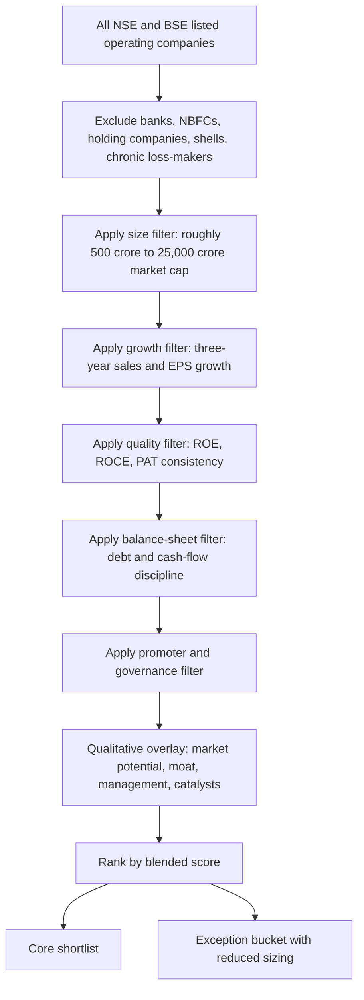

# Potential Multibagger Stocks in India in Vijay Kedia Style

## Executive summary

Vijay Kedia’s directly documented framework is simpler than many investors assume. On his firm’s official website, he compresses his preference into **SMILE**: **small in size, medium in experience, large in aspiration, extra-large in market potential**. The same source also stresses patience, close observation, management track record, and the need to read “between the lines” rather than rely only on surface-level numbers. In practice, that points towards **small and mid-cap companies with long runways, promoter ambition, scalable products, and managements that have already shown execution discipline**. citeturn48view0

To operationalise that style, I converted Kedia’s qualitative principles into a **reproducible screen** across Indian listed equities: market capitalisation broadly in the small/mid-cap zone, sustained growth, decent-to-high return ratios, manageable leverage, promoter alignment, and industries with structural tailwinds. Because Kedia does not publish exact ratio thresholds, the numerical rules below are **my explicit assumptions** designed to approximate his stated philosophy rather than a literal Kedia formula. citeturn48view0turn18view0turn18view1

Using current public market data as of **20 July 2026**, and then validating shortlisted names against official company materials and filings, the **best style-fits** are, in my view, **Caplin Point Laboratories, Shaily Engineering Plastics, Neuland Laboratories, Venus Pipes & Tubes, and Garware Hi-Tech Films**. **Genus Power** is the highest-growth outlier, but it is a weaker fit to a strict Kedia-style quality screen because of leverage and promoter dilution. **TD Power Systems**, **Ram Ratna Wires**, and **Azad Engineering** are included as lower-conviction or exception names rather than core fits. citeturn19view0turn46view0turn50view0turn42view2turn31view0turn31view1turn47view0turn39view0turn31view2

The main conclusion is that a Kedia-style hunter in today’s Indian market should **prefer compounding businesses with identifiable optionality over purely cheap cyclical names**. On that basis, the strongest current balance of **runway, returns, management signalling, and balance-sheet comfort** sits with **Caplin Point**, **Shaily**, **Neuland**, and **Venus**. citeturn45search1turn26view1turn24view0turn42view2turn19view0turn46view0turn50view0turn12view2

## Vijay Kedia style distilled into investable rules

The clearest primary-source statement of Vijay Kedia’s style is the **SMILE** formula on the KSPL website: he wants businesses that are still **small enough to rerate materially**, led by management teams with **some operating maturity**, but with **large ambition** and **very large addressable markets**. That same page also records his investment aphorisms: **“Invest like a bull, sit like a bear, and watch like an eagle”**, the three investor qualities of **knowledge, courage, patience**, and the warning that **poor past management performance usually predicts poor future performance**. He also emphasises forensic reading: **“Read not only between the lines but also what is not written.”** citeturn48view0

Those statements imply seven practical principles. First, **size matters**, because multibaggers need room to grow from a lower base. Second, **management matters more than narrative**, because execution and honesty determine whether growth converts into shareholder value. Third, **the market opportunity must be genuinely large**, not merely a niche with limited ceiling. Fourth, **patience is essential**; Kedia’s own language favours sitting with a winning thesis through time rather than trading around noise. Fifth, he is looking for **evidence of aspiration** in capital allocation, product expansion, and ambition, not just historic profitability. Sixth, he wants investors to do **scuttlebutt-style work**, or at least qualitative cross-checking, rather than depend only on screeners. Seventh, he accepts that the market will often hide the best ideas under temporary complexity, which is why surface-level screening needs a qualitative overlay. citeturn48view0

From those principles, the modern Kedia-style stock is usually not the cheapest stock in the market. It is more often a company with a **credible management team, one or two differentiated products or capabilities, a long runway, acceptable balance-sheet risk, and enough current profitability that growth is self-funded or close to it**. In other words, Kedia-style investing is not cigar-butt investing; it is **early-stage quality growth investing with strong management filters**. That is the basis for the screen below. citeturn48view0

## Screening framework and process

I assumed the starting universe to be **all active NSE/BSE listed operating companies**, then removed obvious non-fits for this style: banks/NBFCs, holding companies, shell-like microcaps, chronically loss-making firms, and businesses with structurally opaque balance sheets. Because Kedia has not disclosed fixed ratios, the numeric rules below are my reproducible approximation of his published philosophy. I first looked at broad live screens on current Indian-listed companies, then applied governance, business-quality, and runway overlays using official filings and presentations. citeturn18view0turn18view1

The **hard filters** I used were these:

| Filter | Rule used | Why it maps to Kedia |
|---|---:|---|
| Market cap | **₹500 crore to ₹25,000 crore** preferred | “Small in size” but still investable |
| Revenue growth | **Three-year sales CAGR ≥ 15%** preferred | Proves market acceptance and scaling |
| Earnings growth | **Three-year EPS CAGR ≥ 18%** preferred | Converts growth into shareholder value |
| Return ratios | **ROE ≥ 15%** or **ROCE ≥ 18%** | Quality and capital efficiency |
| Leverage | **Debt/equity ≤ 0.50** preferred | Balance-sheet resilience |
| Promoter holding | **≥ 45% preferred**; **30–45% acceptable** if governance is sound | Management skin in the game |
| Cash flow | Positive operating cash flow in **at least 3 of the last 5 years** | Reduces accounting-risk candidates |
| Profitability | Positive PAT in each of the last **3 years** | Avoids speculative turnarounds |

The **soft filters** were equally important. I wanted industries with **structural tailwinds**, such as regulated-market pharma, CDMO, GLP-1 delivery systems, specialty materials, smart metering, high-value industrial engineering, value-added pipes, or import-substitution manufacturing. I also used management proxies: **stable shareholding, low or nil pledging, no obvious audit stress, sensible working-capital behaviour, and evidence that management commentary matches subsequent action**. Where a company failed one hard filter but looked unusually strong on runway or moat, I kept it as a **lower-conviction exception** rather than a core name. citeturn48view0turn24view0turn25view0turn42view2turn42view3

I ranked the finalists with a blended score that weights **growth, quality, balance-sheet strength, promoter alignment, valuation discipline, and industry runway**, then overrode the purely quantitative output when the qualitative evidence was clearly better or worse than the raw score suggested. That is why **Genus Power** scores extremely well on growth but ranks below some lower-growth names, while **Azad Engineering** remains only a speculative exception despite a powerful business niche. citeturn31view1turn36view5turn32view5turn31view2turn41view0

## Ranked shortlist

The table below is my **ranked shortlist**. All financials are based on **latest publicly available FY26 annual data** and **latest disclosed shareholding up to Mar/Jun 2026**, with market caps current to **20 July 2026**. Debt/equity is computed from latest reported borrowings over equity plus reserves where needed. “EPS growth” is the three-year CAGR unless marked otherwise. citeturn51view0turn50view0turn46view0turn35view4turn35view0turn34view1turn47view0turn41view1turn41view2turn41view0

| Rank | Company | FY26 revenue ₹ cr | FY26 PAT ₹ cr | EPS growth | ROE | Debt/equity | Promoter holding | Market cap ₹ cr | View |
|---|---|---:|---:|---:|---:|---:|---:|---:|---|
| 1 | Caplin Point Laboratories | 2,187 | 650 | 19.4% | 20.6% | 0.00x | 70.57% | 20,302 | Best mix of promoter alignment, cash generation, and runway |
| 2 | Shaily Engineering Plastics | 921 | 161 | 75.2% | 28.2% | 0.27x | 43.39% | 12,766 | Exceptional execution; valuation is the trade-off |
| 3 | Neuland Laboratories | 2,023 | 364 | 30.6% | 21.2% | 0.16x | 32.63% | 24,510 | CDMO/API chemistry moat and peptide optionality |
| 4 | Venus Pipes & Tubes | 1,167 | 102 | 31.2% | 17.0% | 0.29x | 48.41% | 3,540 | Strong capacity-led compounding with forward integration |
| 5 | Garware Hi-Tech Films | 2,120 | 338 | 26.7% | 13.4% | 0.01x | 60.73% | 16,140 | Specialty-film premiumisation story with balance-sheet comfort |
| 6 | Genus Power Infrastructures | 4,751 | 592 | 159.0% | 29.0% | 1.04x | 39.34% | 9,435 | Massive smart-metering runway; leverage and dilution are the catch |
| 7 | TD Power Systems | 1,856 | 239 | 35.1% | 24.7% | 0.02x | 26.87% | 17,816 | Strong industrial cycle and returns; weak promoter-fit to screen |
| 8 | Sharda Motor Industries | 3,397 | 345 | 19.8% | 27.9% | 0.04x | 64.31% | 4,966 | High-return compounding, but lower market-potential ceiling |
| 9 | Ram Ratna Wires | 5,177 | 109 | 31.0% | 20.6% | 1.16x | 69.30% | 3,945 | Market-share strength and growth; leverage too high for core sizing |
| 10 | Azad Engineering | 603 | 134 | n.m. | 9.1% | 0.31x | 55.84% | 14,984 | Outstanding niche; valuation and cash conversion make it speculative |

**Caplin Point Laboratories.** Caplin is the closest thing in this set to a “clean Kedia-style compounder”: promoter control is strong, debt is negligible, operating cash generation has been consistently healthy, and the company still has a credible reinvestment runway through Latin America, Africa, and regulated markets. Official company materials highlight a growing presence in the US and EU, a long-standing warehouse-led distribution model, Mexico approvals, and the acquisition of ten approved ANDAs with a stated US market opportunity. The principal risks are that working-capital days have risen, regulated-market execution can be slower than expected, and a business this profitable eventually becomes harder to re-rate at the same speed as its earnings. citeturn45search1turn45search0turn45search5turn45search7turn19view0turn20view0turn51view0

**Shaily Engineering Plastics.** Shaily is a high-quality contract manufacturing story moving from ordinary moulding towards higher-value healthcare delivery systems and adjacent precision segments. The official FY26 investor deck shows commercial launches in semaglutide pens, a ₹423 crore order for pen injectors, customer launches in Canada, a Korean semiconductor-tray agreement, and broader diversification outside healthcare. That is exactly the kind of “large in aspiration, extra-large in market potential” expansion Kedia likes. The risks are obvious: the stock is expensive, promoter holding is below my preferred threshold, and any slowdown in GLP-1-related scaling would compress the premium multiple quickly. citeturn26view1turn26view2turn25view0turn46view0turn14view0

**Neuland Laboratories.** Neuland is a strong stylistic fit on business quality, though not on promoter ownership. The company combines mature prime APIs with specialty APIs, CDMO, and now peptide manufacturing optionality. Management’s official FY26 commentary points to short- to medium-term visibility from commercial and near-commercial molecules, alongside planned investment in peptide manufacturing and a new R&D centre. That combination of specialty chemistry and customer stickiness gives Neuland a real moat. The main risks are customer concentration in custom manufacturing, a premium valuation, and the fact that promoter ownership is only in the low-30s rather than at classic Kedia levels. citeturn24view0turn26view0turn28view3turn50view0turn14view1

**Venus Pipes & Tubes.** Venus is one of the cleaner small-cap industrial growth stories in India today. Its FY26 investor presentation shows record annual revenue, all major capacity additions now live, and a forward-integration move into pipe spooling backed by a ₹185 crore LoI from a data-centre customer. This matters because the business is moving from stainless steel pipes towards higher-value engineered solutions, which should improve margins and reduce the “commodity manufacturer” label. Risks include raw-material volatility, capacity ramp-up risk, export cyclicality, and the possibility that the market continues to value it as a pipe maker rather than an integrated solutions company until execution proves otherwise. citeturn42view2turn43view0turn43view1turn35view4turn14view2

**Garware Hi-Tech Films.** Garware has the least exciting headline growth among the top five, but probably the strongest combination of promoter ownership and visible product differentiation. Screener’s company summary, drawing on company and exchange materials, notes that Garware has shifted from commodity polyester films to premium specialty films, with value-added products contributing roughly 87% of revenue. That premiumisation is exactly why I keep it in the top five despite a lower ROE than the rest. Risks are slower incremental growth versus the faster names above, the chance that the market already recognises much of the specialty transition, and working-capital creep. citeturn31view0turn32view4turn28view1turn29view2

**Genus Power Infrastructures.** Genus is the most explosive growth story in the list and probably the strongest candidate if the investor prioritises **market potential** above every other variable. In its official FY26 release, management says Genus has crossed installation of more than **1 crore** smart meters, has annual manufacturing capacity above **18 million meters**, and sees an Indian opportunity of over **31–32 crore** meters, of which only around **15.6 crore** have been tendered so far. The problem is that this is not a textbook Kedia-quality balance-sheet profile yet: borrowings are high, working-capital is still heavy, and promoter ownership has fallen meaningfully. I would treat it as an exception name, not a core one. citeturn42view3turn43view2turn31view1turn34view1turn36view5turn32view5

**TD Power Systems.** TD Power fits the “medium in experience, large in aspiration” mould well on operations: the company has strong return ratios, almost no debt, strong profit growth, and exposure to a broad industrial and energy-cycle recovery. The official investor-relations page shows a deep archive of results and presentations, which at least supports a transparent disclosure history. However, current promoter ownership has dropped to roughly 27%, which weakens the classic Kedia-style “promoter skin in the game” filter. At the current high multiple, I prefer it as a watchlist or secondary allocation rather than a core Kedia-style bet. citeturn47view0turn37view0turn30search1

**Sharda Motor Industries.** Sharda is not the “sexiest” story here, but it is one of the cleanest operating businesses in the list: strong ROE and ROCE, very low leverage, high promoter holding, and steady profits. The issue is not quality; it is **ceiling**. Auto components and emission systems can compound, but the addressable market is not as vast or open-ended as GLP-1 devices, smart metering, or regulated-market pharma. In a Kedia-style basket, I would view it as a stabiliser rather than the highest-upside bet. citeturn31view3turn34view3turn41view1turn32view7

**Ram Ratna Wires.** Ram Ratna deserves a place in the extended shortlist because it is the second-largest winding-wire manufacturer in South Asia, has sustained double-digit growth, and still has very high promoter ownership. The FY25 annual-report commentary also stresses resilience and strategic growth, which matches the broad business trend. But leverage is too high for a strict Kedia-style core position, and copper-linked businesses can look deceptively strong late in a volume cycle. It is investable, but only with tighter risk limits. citeturn39view0turn41view2turn40view0turn38search8

**Azad Engineering.** Azad has one of the most compelling business narratives in India: life-critical precision components for aerospace, defence, energy, and turbines, with complex manufacturing processes and sticky OEM relationships. That absolutely fits the “extra-large market potential” and aspiration criteria. Yet at present it fails the rest of the Kedia-style discipline test: ROE is still low, free cash flow and working capital are weak, and the valuation is very rich. I view it as a fine company but not yet a classic Kedia-style purchase unless a future correction or operating inflection improves the risk-reward equation. citeturn31view2turn34view2turn41view0turn32view6

## Deep dive on the leading candidates

The table below compares the **top five** in more depth. The “valuation read” is partly an inference from current P/E and business mix, rather than a full separate peer-model. Where I say “premium” or “reasonable”, I mean relative to the kind of sector multiple that businesses with their quality and runway typically command, not a single definitive fair value target. citeturn19view0turn46view0turn50view0turn42view2turn31view0

| Company | What makes management credible | Moat | Tailwind | Likely catalysts | Valuation read |
|---|---|---|---|---|---|
| Caplin Point | Long execution record, high promoter holding, warehouse-led model, repeated USFDA/ANDA progress | Distribution plus manufacturing integration across emerging and regulated markets | Latin America growth, US injectables, Mexico approvals, ANDA acquisitions | More product approvals, regulated-market scaling, continued PAT compounding | **Reasonable/mid-range** for a 20% profit grower with optionality |
| Shaily | Evidence of execution across multiple adjacent verticals in official FY26 updates | Qualification barriers in healthcare devices and precision plastics | GLP-1 pens, healthcare outsourcing, electronics and semiconductor trays | Pen injector ramp-up, semiconductor-tray commercialisation, margin scale-up | **Premium** and already discounts strong growth |
| Neuland | Management is explicitly investing ahead for peptides and R&D capacity | Complex chemistry, CDMO relationships, specialty API know-how | Pharma outsourcing, peptide demand, regulated chemistry spending | Peptide capacity commissioning, new molecule wins, CMS scaling | **Premium**, but less obviously excessive than Shaily if peptide optionality lands |
| Venus Pipes | Management has moved from capacity addition to forward integration with anchor demand | Integrated stainless product set plus move into engineered spooling | Data centres, process industries, domestic substitution, export acceptance | Capacity utilisation ramp-up, spooling execution, better margins | **Reasonable to moderately premium** given value-added shift |
| Garware Hi-Tech Films | Long promoter continuity and steady premiumisation strategy | Specialty film mix and brands rather than commodity BOPET exposure | Automotive and architectural films, film premiumisation | Better specialty mix, penetration in higher-value applications | **Premium** to commodity film names, but arguably deserved |

Source support for this comparison: Caplin official company and filings. citeturn45search1turn45search0turn45search5turn45search7turn19view0turn20view0turn51view0  
Source support for this comparison: Shaily official FY26 presentation and current financial page. citeturn25view0turn26view1turn26view2turn46view0turn14view0  
Source support for this comparison: Neuland official presentation and company financial pages. citeturn24view0turn26view0turn28view3turn50view0turn14view1  
Source support for this comparison: Venus official FY26 investor presentation and current metrics. citeturn42view2turn43view0turn43view1turn35view4turn14view2  
Source support for this comparison: Garware company summary and investor/annual-report pages. citeturn31view0turn32view4turn28view1turn29view2

The growth profile of the top five is not uniform. **Venus** and **Neuland** have shown the strongest indexed revenue expansion from FY22–FY26, while **Caplin** has delivered the steadiest, least-volatile compounding path. **Shaily** looks slower on revenue than its share-price narrative suggests, but its profit curve is inflecting much faster than its sales curve, which usually means operating leverage is finally kicking in. **Garware** is the most mature of the lot, which is why the case there is more about **mix improvement and sustained premiumisation** than about hyper-growth. citeturn51view0turn35view2turn34view5turn35view4turn35view0

On profits, the story is even clearer. **Neuland** and **Shaily** have the strongest PAT acceleration among the core names, which is why both deserve place near the top despite richer multiples. **Caplin** remains the cleaner quality-compounder, but its shape is less explosive because it is already at a larger, more mature profit base. citeturn51view0turn35view2turn34view5turn35view4turn35view0

A broader map of the shortlisted companies also shows why some names are only secondary ideas. **Genus** sits at the extreme-right of the growth spectrum but carries more balance-sheet and promoter risk. **Sharda** has excellent ROE but much lower growth. **Azad** has strong top-line momentum but weak current returns. In other words, the best Kedia-style names are not necessarily the fastest growers; they are the names where **growth, management quality, and balance-sheet safety overlap**. citeturn31view1turn36view5turn41view1turn31view2turn41view0turn19view0turn46view0turn50view0

## Entry, exit, and position sizing framework

Because the user has specified **no time-horizon constraint**, the right way to act on this report is not to chase the most recent winner. It is to build a **process**. Kedia’s own documented emphasis on patience and observation suggests that entries should be **staggered** and thesis-led, not all-in-at-once. A sensible framework is to buy in **three tranches**: an initial position when the business qualifies, a second tranche after one or two confirming quarterly updates, and a final tranche on either a market correction or a fresh operational trigger such as capacity commissioning, approval wins, or order-book conversion. citeturn48view0turn24view0turn25view0turn42view2turn42view3

For **conservative investors**, I would only use the **top five core names**, with individual position sizes of roughly **3% to 5%** and sector caps of **12% to 15%**. In that profile, I would avoid or keep token tracking positions in **Genus, TD Power, Ram Ratna, and Azad** until balance-sheet comfort, promoter alignment, or valuation improves. For **balanced investors**, a portfolio of **6–8 names** works, with **5% to 7%** allocated to the top three and **2% to 4%** to exception names. For **aggressive investors**, a **core-satellite structure** is better: **Caplin, Shaily, Neuland, and Venus** as core, with **Genus or Azad** as satellites at smaller sizes that are explicitly treated as higher-risk opportunities rather than equivalent convictions. citeturn19view0turn46view0turn50view0turn42view2turn31view1turn47view0turn41view2turn31view2

The **exit framework** should be based on thesis damage, not price alone. I would treat the following as red flags requiring an exit review: promoter pledging or unexplained share sales, large debt-funded expansion without matching cash generation, repeated slippage in capacity ramp-up, working-capital blowouts without revenue conversion, qualified audit comments, or evidence that management commentary has stopped matching subsequent results. Kedia’s own warning about management track record is especially relevant here: when execution quality deteriorates, the investment case changes before the price chart fully reflects it. citeturn48view0turn41view0turn36view5turn51view0

A practical **trim rule** is also useful. I would trim rather than exit if a stock becomes so expensive that price advances are running far ahead of earnings upgrades, especially in the premium names like **Shaily, Neuland, TD Power, and Azad**. Conversely, I would be more willing to hold through normal volatility in **Caplin, Venus, and Garware**, because their balance-sheet profiles and business visibility are stronger. citeturn46view0turn50view0turn47view0turn31view2turn19view0turn42view2turn31view0