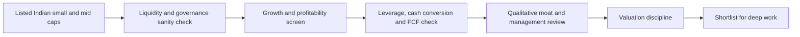
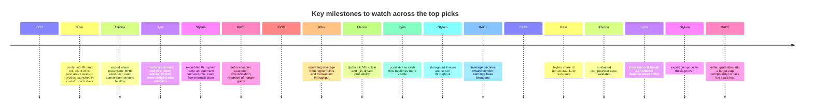

# Hunting Multibaggers in the Indian Market

## Executive summary

A workable definition of a *multibagger* is simple: a stock that returns multiple times the original investment, with a two-bagger meaning a doubling and larger “baggers” denoting progressively higher multiples. The term was popularised by Peter Lynch; for this report, I assume a practical hunting horizon of **three to seven years**, because that is long enough for earnings compounding, capacity additions, market-share gains and re-rating to work together, but short enough to remain investable for an active public-equity portfolio. citeturn26search0turn26search2turn26news26

Using Vijay Kedia’s public framework as the cultural backbone rather than a script to imitate, the right hunting ground in India still looks like **small and mid caps with a believable runway, experienced management, large addressable markets, and the ability to convert growth into cash**. Kedia’s best-known public mnemonic, **SMILE**, emphasises businesses that are *small in size, medium in experience, large in aspiration and extra-large in market potential*. He has also repeatedly stressed patience, management quality, and the importance of backing a business story early rather than chasing price after the whole market agrees. citeturn3search7turn3search8

The Indian backdrop remains supportive for selected financial and manufacturing names. The strongest current structural tailwind in this report is the financialisation theme: AMFI says Indian mutual fund industry AUM stood at **₹82.22 lakh crore** on 30 June 2026, with **27.86 crore folios** and record-high SIP contributions of **₹31,781 crore** in June 2026. That is fertile ground for mission-critical financial infrastructure platforms such as KFin Technologies. On the industrial side, the opportunity set is strongest where import substitution, export competitiveness, automation, defence indigenisation or premiumisation create a long runway rather than a one-year trade. citeturn25search0turn25search1turn25search3

After applying a Kedia-style but balance-sheet-conscious screen, the most interesting current watchlist is: **KFin Technologies, Elecon Engineering, Jyoti CNC Automation, Stylam Industries, RACL Geartech, Cera Sanitaryware, Garware Hi-Tech Films, Data Patterns, eClerx Services, and Acutaas Chemicals**. My preferred **top five today**, balancing runway, business quality, valuation discipline and execution visibility, are **KFin Technologies, Elecon Engineering, Jyoti CNC Automation, Stylam Industries and RACL Geartech**. The common thread is not that they are optically cheap; it is that each has a plausible path to become materially larger over the next cycle. citeturn13view0turn13view1turn13view3turn13view8turn36view2

One sober conclusion matters. As of mid-July 2026, many of India’s better small and mid-cap businesses are **not deep value ideas**. In this market, the more realistic base case is often **1.5x to 2.5x over three to five years**, not a casual five-bagger. The outsized multibagger outcome still exists, but it now requires a more exacting combination of sustained earnings growth, prudent capital allocation, and either a durable premium multiple or entry during sharp market corrections. That is why this report treats valuation as a filter, not an afterthought. citeturn13view0turn10search2turn36view0turn20view0turn36view2

## The Kedia lens and what counts as a multibagger

Vijay Kedia’s public comments are unusually consistent. Across interviews and talks, he has argued that the search should begin with **small or mid-sized companies** where management has seen enough cycles to avoid naïve errors, yet still has the ambition to become a far larger business. That is the core of his SMILE framework. He has also stressed that a stock idea is strongest when a **large market opportunity meets a clean, experienced management team** before institutional ownership fully crowds the name. citeturn3search7turn3search8

A concise Kedia-style checklist, paraphrased from his public remarks, looks like this. Start with a company that is still relatively small in its sector, led by managers with meaningful industry experience and a clean record. Favour sectors with long demand runways rather than sunset industries. Look for businesses where aspiration is visible in capital allocation, product expansion, export ambition or organisational build-out. Stay patient enough to let the business, not daily price noise, do the compounding. citeturn3search7turn3search8

For this report, I define a **multibagger candidate** as a business that can plausibly deliver at least **100% total return** over **three to seven years** through some combination of revenue growth, margin expansion, free-cash-flow improvement and valuation resilience. In practice, that means I am not merely looking for “cheap stocks”. I am looking for businesses that can become **meaningfully larger enterprises**. That distinction matters, because a low P/E without scale economics often becomes a value trap, whereas the right high-quality small-cap can still be a bargain in time even if it does not look optically cheap on next-twelve-month numbers. citeturn26search0turn26search2turn26news26

The way I translate Kedia’s philosophy into a modern screen is straightforward: the story must be attractive, but the story must also survive the accounting. If cash conversion is weak, leverage is creeping up, promoter incentives are questionable, or the market size is too small, the “story” is probably just a costume. That is especially important in India’s small and mid-cap universe, where narrative can run far ahead of evidence. The best candidates are usually the ones where the **numbers and the narrative are singing the same song**. The rest are only making noise. citeturn3search7turn15view1turn15view3turn16view1turn19view2

## Screening framework and assumptions

I assume **no user-specified risk tolerance or capital constraint**, so the report is built for a **high-risk small/mid-cap equity sleeve inside a diversified portfolio**, not for a concentrated all-in strategy. In portfolio terms, that means initial position sizes should usually start in the **two to five per cent** range, with larger sizing reserved for businesses that combine secular runway, strong cash generation and defensible governance. That sizing framework is my own portfolio-construction assumption, not a market rule.

The screening methodology below prioritises official and primary sources where possible: **company annual reports and investor relations pages, BSE/NSE filings, company websites, and AMFI for industry data**. I use Screener as a practical aggregation layer because it surfaces historical P&L, balance-sheet, cash-flow and shareholding data that are ultimately sourced from exchange filings; ratios such as approximate EV/EBITDA, debt/equity and FCF margin are then derived from those reported figures. citeturn24search0turn24search1turn29search5turn30search0turn31search4turn25search0

The quantitative defaults I used are below. These are not universal truths; they are the **default hurdles** that best fit a Kedia-style search in the July 2026 Indian market.

| Filter | Default threshold | Why it matters |
|---|---:|---|
| Market cap | **₹1,500 crore to ₹25,000 crore** | Small enough for under-ownership and operating leverage; large enough to have liquidity and audited operating history |
| Revenue CAGR | **≥12% over 3 years** or a clear path to that level | Compounding needs growth; a flat topline rarely creates multibaggers |
| ROE | **≥15%** | Keeps the list anchored to capital efficiency |
| Debt/equity | **≤0.5**; exceptions only for de-leveraging capex stories | Protects against balance-sheet fragility |
| Promoter holding | **≥40% preferred** | Aligns incentives, though exceptions are allowed for professionally-managed platforms |
| FCF margin | **Positive over a cycle**; capex-heavy firms can be temporarily negative if capacity expansion is visible | Distinguishes real growth from receivables-led growth |
| CFO/OP | **Typically above 60% over time** | Screens for earnings quality |
| Cash conversion cycle | Stable or improving | Prevents hidden balance-sheet stress |
| Valuation | Avoid extremes unless runway is exceptional | Multibaggers can start expensive, but valuation must still leave room for compounding |

Those thresholds come directly from the practical needs of multibagger hunting in India. Small size without a big market is useless. Rapid growth without cash conversion is suspicious. Great management with no ambition is sterile. Cheap valuation without business quality is a trap. In other words, the filter is not designed to find the “best ratios”; it is designed to find the **best stories that the ratios can still support**. That is very much in the spirit of Kedia’s public approach. citeturn3search7turn3search8

This is the screening funnel I used.

On qualitative filters, I prioritised five questions. Does management have a record of scaling intelligently rather than merely announcing capex. Is the business model genuinely difficult to replicate. Does the company sit inside a sectoral tailwind large enough to matter for at least one full cycle. Is there evidence of pricing power, process edge, customer stickiness or distribution depth. And finally: if I ignore the stock chart, does the company look more durable today than it did three years ago. If the answer is “no”, it cannot be a top pick.

## Candidate watchlist

The table below shows the final **ten-company watchlist**. Live prices and market capitalisation are from company pages accessed between **14 and 20 July 2026**. Revenue growth, return ratios, borrowings, reserves, shareholding and cash-flow data come from the same company pages; **EV/EBITDA, debt/equity and FCF margin are approximate calculations derived from those reported figures**, so they should be treated as practical valuation markers rather than exchange-published live ratios. “n.a.” means meaningful listed history is too short for a comparable figure. citeturn13view0turn13view1turn27view0turn36view0turn13view4turn13view5turn36view1turn36view2turn20view0turn13view9

| Company | Mkt cap | P/E | EV/EBITDA | Revenue CAGR 3Y / 5Y | ROE | Debt / equity | Promoter holding | FCF margin | Price perf 1Y / 3Y / 5Y |
|---|---:|---:|---:|---:|---:|---:|---:|---:|---:|
| KFin Technologies citeturn13view0turn15view0turn15view1 | ₹15,574 cr | 43.9x | ~30x | 19% / 20% | 23.3% | ~0.03x | 22.86% | ~26.5% | -29% / 33% / n.a. |
| Elecon Engineering citeturn10search2turn14view0turn15view2turn15view3 | ₹10,691 cr | 36.1x | ~21x | 19% / 20% | 19.2% | ~0.12x | 59.28% | ~9.3% | -24% / 9% / 46% |
| Acutaas Chemicals citeturn27view0turn14view1turn16view0turn16view1 | ₹28,325 cr | 79.5x | ~59x | 30% / 32% | 24.0% | ~0.02x | 32.66% | ~-2.7% | 204% / 81% / n.a. |
| Jyoti CNC Automation citeturn36view0turn16view2turn16view3 | ₹17,757 cr | 45.3x | ~32x | 33% / 35% | 17.3% | ~0.24x | 62.55% | ~-9.3% | -23% / n.a. / n.a. |
| Cera Sanitaryware citeturn13view4turn14view2turn21view0turn21view1 | ₹7,895 cr | 32.0x | ~24x | 10% / 10% | 18.2% | ~0.05x | 54.41% | ~4.9% | -13% / -8% / 6% |
| Garware Hi-Tech Films citeturn13view5turn14view3turn21view2turn21view3 | ₹16,505 cr | 49.3x | ~43x | 14% / 15% | 13.7% | ~0.00x | 60.73% | ~5.2% | 93% / 99% / 50% |
| Data Patterns citeturn36view1turn17view0turn17view1turn17view2 | ₹22,563 cr | 91.3x | ~60x | 27% / 33% | 15.2% | ~0.00x | 42.41% | ~0.9% | 48% / 26% / n.a. |
| RACL Geartech citeturn36view2turn17view3turn18view0turn18view1 | ₹1,581 cr | 32.2x | ~17x | 11% / 19% | 17.0% | ~0.67x | 42.70% | ~8.0% | 47% / 1% / 19% |
| Stylam Industries citeturn20view0turn18view2turn18view3 | ₹5,533 cr | 37.0x | ~25x | 6% / 19% | 20.4% | ~0.04x | 54.10% | ~-0.2% | 101% / 28% / 30% |
| eClerx Services citeturn13view9turn19view0turn19view1turn19view2 | ₹16,161 cr | 35.3x | ~24x | 15% / 19% | 35.6% | ~0.21x | 54.53% | ~14.4% | -1% / 24% / 19% |

A few ranking comments matter more than the table itself. **KFin** is the cleanest “financialisation-of-India” platform. **Elecon** is a cash-generative industrial compounder with both domestic and export optionality. **Jyoti** is a high-operating-leverage machine-tools play on Indian manufacturing sophistication. **Stylam** is a nimble export-led building-products story with a strong brand and near-zero leverage. **RACL** is the smallest-cap optionality idea in the group: higher-risk, but still sensible enough to analyse because the business has improved margins, debt metrics and customer depth. Meanwhile, **Acutaas**, **Data Patterns** and **Garware** remain excellent businesses or stories, but at today’s prices I view them more as watchlist names than as my first line of fresh capital. citeturn35search0turn29search1turn36view0turn31search1turn36view2

## Deep dives on the top ideas

### KFin Technologies

**Business overview and why it fits the screen**

KFin serves mission-critical financial infrastructure across mutual funds, AIFs, pension, wealth and issuer services. On its own website, the company says it serves **31 of India’s 59 mutual fund AMCs**, has the **number-one corporate registrar position in India**, serves **109 global asset managers across Southeast Asia and other geographies**, manages **₹26.4 trillion of mutual-fund AAUM**, and handles **360 million investor folios**. That combination of sticky workflow, high switching costs and financialisation tailwinds is exactly the sort of platform business that can look expensive on one year’s earnings yet still compound for a long time. citeturn35search0turn35search2

The tailwind is real, not theoretical. AMFI’s June 2026 data show an Indian mutual-fund AUM base of **₹82.22 lakh crore**, **27.86 crore folios**, and record SIP flows. If even a modest share of that growth continues to formalise through digital distribution and retirement products, KFin has a sensible runway not only in domestic mutual funds but also in AIF administration, pension, issuer services and overseas processing. The company’s FY26 numbers already reflect that operating leverage: sales grew to **₹1,159 crore**, operating profit to **₹508 crore**, profit to **₹346 crore**, with **free cash flow of ₹307 crore** and **CFO/OP of 96%**. citeturn25search0turn25search1turn13view0turn15view1

**Financial model and assumptions**

My base case assumes KFin continues compounding via domestic MF flows, AIF scaling, issuer solutions and incremental international wins. I do **not** assume a dramatic margin jump, because the business is already highly profitable.

| Metric | FY26A | FY29E bear | FY29E base | FY29E bull |
|---|---:|---:|---:|---:|
| Revenue | ₹1,159 cr | ₹1,660 cr | ₹1,810 cr | ₹2,000 cr |
| EBITDA | ₹508 cr | ₹700 cr | ₹790 cr | ₹900 cr |
| PAT | ₹346 cr | ₹465 cr | ₹540 cr | ₹620 cr |
| Core assumptions | — | 13% sales CAGR | 16% sales CAGR | 20% sales CAGR |
|  | — | 42% EBITDA margin | 43.5% EBITDA margin | 45% EBITDA margin |

These projections are my estimates grounded in the historical cadence of sales growth, current margin profile, and the structural industry tailwind from AMFI data. citeturn13view0turn15view1turn25search0

**Valuation, sensitivity and position sizing**

KFin is not cheap on classic DCF logic because platform businesses with long duration often front-load valuation. On a base-case DCF, I get roughly **₹980 per share**, with a bear-to-bull range of **₹830 to ₹1,120** depending principally on medium-term FCF growth and discount rate. Relative valuation is more generous: applying **38x, 41x and 45x** to base-case FY29 EPS gives a value band of roughly **₹1,190 to ₹1,410**. With the stock around **₹901** on 10 July 2026, the realistic three-year upside is moderate in the base case but can still become a multibagger over **five years** if earnings compound near 18–20% and the capital-markets infrastructure franchise broadens. citeturn13view0turn15view1

| Sensitivity | Bear | Base | Bull |
|---|---:|---:|---:|
| DCF value / share | ₹830 | ₹980 | ₹1,120 |
| Relative value / share | ₹1,190 | ₹1,280 | ₹1,410 |
| Implied stance | Hold/accumulate on dips | Buy on weakness | Add aggressively in corrections |

My preferred initial sizing is **3% to 4%** of a diversified small/mid-cap sleeve. The main risk is not insolvency or governance blow-up; it is **paying too much for a good business**. The relevant holding period is **five years, not five months**.

### Elecon Engineering

**Business overview and why it fits the screen**

Elecon is a case study in industrial revival done with discipline. The company’s FY2024-25 annual-report microsite says the **Industrial Gear Division** generated **₹1,763 crore** of revenue with **24.7% EBIT margin**, while the **Material Handling Equipment** division grew strongly, with revenue up to **₹464 crore** and EBIT margin of **28.4%**. Management also says international business contributed about **23% of consolidated revenue** in FY2024-25 and that the company is targeting a more balanced global contribution by 2029-30. This matters because the multibagger path is not only domestic capex; it is also export share and mix improvement. citeturn29search1turn29search3

The historic numbers remain strong even after the market cooled. FY26 sales reached **₹2,016 crore**, operating profit **₹475 crore**, and free cash flow **₹188 crore**. Promoter holding remains high at **59.28%**, and the business produced **CFO/OP of 82%** in FY26. The nuance is that FY26 statutory profit benefited from very high other income, so I treat **TTM profitability and EBITDA** as the cleaner base for forward valuation than a single-year PAT line. That is exactly the sort of accounting adjustment a serious multibagger hunter must make. citeturn22view0turn15view2turn15view3

**Financial model and assumptions**

My model assumes domestic project activity remains healthy, the MHE export opportunity becomes more visible, and margins hold in the mid-twenties rather than expanding dramatically from here.

| Metric | FY26A | FY29E bear | FY29E base | FY29E bull |
|---|---:|---:|---:|---:|
| Revenue | ₹2,016 cr | ₹2,550 cr | ₹2,950 cr | ₹3,250 cr |
| EBITDA | ₹475 cr | ₹600 cr | ₹720 cr | ₹820 cr |
| Normalised PAT | ~₹300–320 cr | ₹340 cr | ₹430 cr | ₹500 cr |
| Core assumptions | — | 8% sales CAGR | 13–14% sales CAGR | 17% sales CAGR |
|  | — | 23.5% margin | 24.5% margin | 25%+ margin |

The “normalised PAT” line is my own adjustment because the FY26 reported PAT includes unusually large other income. That makes Elecon analytically sounder than the screen suggests: the market multiple looks richer on clean earnings than on one-off-assisted profits. citeturn22view0turn29search1

**Valuation, sensitivity and position sizing**

On a DCF anchored to normalised cash generation, I get a fair-value range of roughly **₹470 to ₹620 per share**, with the middle of the range around **₹545**. On relative multiples, using **28x to 32x** FY29 EPS produces a similar band. Against a July 2026 price of about **₹477**, the base-case upside is not explosive, but the five-year odds of respectable compounding remain good if exports and the higher-margin mix continue to improve. This is a **high-quality compounding industrial**, not a lottery-ticket small cap. citeturn10search2turn22view0

| Sensitivity | Bear | Base | Bull |
|---|---:|---:|---:|
| DCF value / share | ₹470 | ₹545 | ₹620 |
| Relative value / share | ₹540 | ₹575 | ₹615 |
| Upside from ~₹477 | flat to modest | low-teens | mid-20s |

I would size Elecon at **2.5% to 3.5%** initially, and I would be happiest buying it during cyclical disappointment rather than euphoric rerating. The risk is not leverage; the risk is a down-cycle in industrial demand or export order slippage.

### Jyoti CNC Automation

**Business overview and why it fits the screen**

Jyoti is one of the most interesting “aspiration meets market size” stories in the universe. Screener’s company write-up, which cites company and exchange documents, says Jyoti is a leading Indian manufacturer of simultaneous **five-axis CNC machines**, offers **200+ product variants across 44 product verticals**, and sold **5,550 machines in FY26 versus 4,072 in FY25**. The company also has overseas manufacturing and commercial presence through France, Germany and Canada, which is strategically useful in a machine-tools market where credibility, engineering support and product breadth matter. citeturn36view0turn29search8turn30search0

The financial profile is exactly what one expects from a serious manufacturing scale-up: fast revenue growth, improving margins, but still demanding working capital and capex. FY26 sales were **₹1,949 crore**, operating profit **₹564 crore**, and PAT **₹391 crore**, but free cash flow was still **negative ₹182 crore** and the cash-conversion cycle remained heavy at **313 days**. This is why the stock belongs in a multibagger report but not in the “buy blindly and forget” basket. It needs monitoring. citeturn13view3turn16view2turn16view3

**Financial model and assumptions**

I assume continued Indian manufacturing automation, improving product mix and steadier execution from the group’s international assets, but I also assume cash conversion improves only gradually.

| Metric | FY26A | FY29E bear | FY29E base | FY29E bull |
|---|---:|---:|---:|---:|
| Revenue | ₹1,949 cr | ₹2,700 cr | ₹3,200 cr | ₹3,650 cr |
| EBITDA | ₹564 cr | ₹760 cr | ₹930 cr | ₹1,080 cr |
| PAT | ₹391 cr | ₹500 cr | ₹610 cr | ₹740 cr |
| FCF profile | negative / weak | near neutral | positive by FY28–29 | strong positive by FY29 |
| Core assumptions | — | 11% sales CAGR | 18% sales CAGR | 23% sales CAGR |

The crucial variable is not revenue alone. It is whether the business can convert fast growth into better working-capital discipline. If that conversion improves, the valuation can hold. If it does not, the market will punish the stock for being a capital-hungry story. citeturn36view0turn16view3

**Valuation, sensitivity and position sizing**

My fair-value range is **₹720 to ₹1,210** per share using a mix of DCF and FY29 relative multiple scenarios. Around **₹781**, the stock is no longer cheap, but the three-year risk/reward is still attractive enough for a growth sleeve because this is one of the better public plays on India’s move up the manufacturing sophistication curve. A true multibagger outcome likely requires a **five-year** rather than a three-year holding period. citeturn36view0

| Sensitivity | Bear | Base | Bull |
|---|---:|---:|---:|
| DCF value / share | ₹720 | ₹860 | ₹1,010 |
| Relative value / share | ₹940 | ₹1,080 | ₹1,210 |
| Upside from ~₹781 | limited | meaningful | strong |

I would size Jyoti at **2% to 3%** initially. The principal downside risks are working-capital stretch, cyclical order softness and margin dilution if mix deteriorates.

### Stylam Industries

**Business overview and why it fits the screen**

Stylam is a quieter but very credible Kedia-style candidate: a focused building-materials company with export ambition, engineering-led manufacturing and prudent balance-sheet behaviour. On its official website, Stylam says it has over three decades of history, was recognised as an export house in 1996, became debt-free in 2023, and in 2025 expanded an **export-oriented third manufacturing plant**. It also says it manufactures around **20 million laminate sheets annually**, has over **1,200 laminate designs**, and aspires to be a global leader in surface solutions. That combination of niche category leadership, export focus and operating discipline is exactly the kind of texture one looks for in a genuine small-cap compounder. citeturn31search1turn31search2turn31search4

The numbers show a sound business even if near-term cash flow looks lumpy. FY26 sales were **₹1,129 crore**, operating profit **₹220 crore**, PAT **₹149 crore**, and borrowings stayed very low relative to equity. Promoter holding was **54.10%**, while the business remained effectively near debt-free and still generated strong historical returns on capital. Free cash flow was slightly negative in FY26 because the company is still investing, but the longer history shows that Stylam can generate cash when capex intensity normalises. citeturn20view0turn18view3

**Financial model and assumptions**

This is an export-led growth-plus-operating-leverage story. I assume moderate domestic demand, continued export penetration and no heroic margin expansion.

| Metric | FY26A | FY29E bear | FY29E base | FY29E bull |
|---|---:|---:|---:|---:|
| Revenue | ₹1,129 cr | ₹1,420 cr | ₹1,635 cr | ₹1,860 cr |
| EBITDA | ₹220 cr | ₹265 cr | ₹320 cr | ₹380 cr |
| PAT | ₹149 cr | ₹185 cr | ₹228 cr | ₹275 cr |
| Core assumptions | — | 8% sales CAGR | 13% sales CAGR | 18% sales CAGR |
|  | — | 18.5% margin | 19.5% margin | 20.5% margin |

The model is intentionally conservative because building products are cyclical, and export-facing businesses do not deserve permanent perfection multiples. citeturn20view0turn31search1

**Valuation, sensitivity and position sizing**

At around **₹3,262**, Stylam already reflects much of its quality. My DCF range is **₹2,900 to ₹3,900**, while a relative valuation based on FY29 EPS gives roughly **₹3,250 to ₹4,320**. That means the base case is respectable rather than spectacular, but the stock remains worthy because the business can still grow into the valuation if execution stays disciplined. For a true multibagger, one would need either a sharper step-up in exports and premium product mix, or to buy into a broader market correction. citeturn20view0turn23view3

| Sensitivity | Bear | Base | Bull |
|---|---:|---:|---:|
| DCF value / share | ₹2,900 | ₹3,350 | ₹3,900 |
| Relative value / share | ₹3,240 | ₹3,780 | ₹4,320 |
| Upside from ~₹3,262 | little | moderate | strong |

I would size Stylam at **2% to 3%**. It is a business I would prefer to **accumulate on corrections**, not chase after parabolic moves.

### RACL Geartech

**Business overview and why it fits the screen**

RACL is the most “small company, large aspiration” idea in the top five. The Screener profile, citing exchange documents and external ratings material, says RACL manufactures **transmission gears and shafts**, serves automotive and industrial applications, has **22 active customers** and **900+ SKUs**, and has reduced debt. Its FY26 results show the business crossing a new scale threshold: consolidated sales at **₹490 crore**, operating profit **₹107 crore**, PAT **₹49 crore**, free cash flow **₹39 crore**, and **CFO/OP of 93%**. That combination of stronger profitability and better cash generation is precisely what one wants to see before calling a small-cap auto ancillary a serious multibagger candidate. citeturn36view2turn22view3turn18view1

There are also visible rough edges, which is why the upside can still be meaningful. Debt/equity remains elevated versus the rest of this list at roughly **0.67x**, promoter holding has fallen materially to **42.70%**, and working-capital intensity is still high. But because the market cap is only about **₹1,581 crore**, even a few years of clean execution, debt reduction and successful customer additions can change the earnings power materially. In small caps, size itself is part of the opportunity—provided the balance sheet does not break first. citeturn36view2turn18view0turn18view1

**Financial model and assumptions**

I assume modest customer additions, steady export execution, gradual deleveraging and margin stability rather than heroic improvement.

| Metric | FY26A | FY29E bear | FY29E base | FY29E bull |
|---|---:|---:|---:|---:|
| Revenue | ₹490 cr | ₹640 cr | ₹780 cr | ₹920 cr |
| EBITDA | ₹107 cr | ₹135 cr | ₹172 cr | ₹212 cr |
| PAT | ₹49 cr | ₹68 cr | ₹92 cr | ₹118 cr |
| Debt trajectory | elevated | stable | lower by FY29 | meaningfully lower |
| Core assumptions | — | 9% sales CAGR | 17% sales CAGR | 23% sales CAGR |

This is a classic higher-risk, higher-potential small cap. If execution stumbles, the bear case is ordinary. If execution is clean, the base and bull cases can matter. citeturn22view3turn18view1

**Valuation, sensitivity and position sizing**

My DCF range is **₹1,260 to ₹1,700** per share, while a relative multiple on FY29 EPS yields **₹1,560 to ₹2,180**. Against a market price around **₹1,341**, the asymmetry is better than in most of the larger names in this report. That is why RACL makes the top five despite the leverage. The business is not as proven as KFin or Elecon, but the **market-cap starting point** leaves more room for re-rating if execution holds. citeturn36view2turn18view1

| Sensitivity | Bear | Base | Bull |
|---|---:|---:|---:|
| DCF value / share | ₹1,260 | ₹1,480 | ₹1,700 |
| Relative value / share | ₹1,560 | ₹1,870 | ₹2,180 |
| Upside from ~₹1,341 | limited downside | solid | strong |

I would keep RACL at **1.5% to 2.5%** initially because the stock sits in the “promising but still proving itself” bucket.

### Key milestones

The next few years matter more than next week’s price tape. The timeline below captures the milestones I would watch for the top five names.

This timeline is a synthesis of the company data, sector positioning and explicit assumptions used in the models above. citeturn35search0turn29search1turn36view0turn31search1turn36view2

## Risks and portfolio construction

The macro risk in July 2026 is not that India lacks a structural growth story; it is that **small and mid-cap pricing already discounts a fair amount of optimism**. AMFI’s record SIP and folio data are a tailwind for formal savings and platform businesses, but they also remind us that retail liquidity is currently abundant. When liquidity is abundant, discipline tends to go on holiday. The multibagger hunter must therefore separate “great business” from “great entry price”. citeturn25search0turn25search3

Sectoral risks differ sharply across the list. Financial infrastructure names such as KFin face market-volume sensitivity and regulatory scrutiny, though their core services remain sticky. Industrial names such as Elecon and Jyoti are exposed to capex cycles, execution bottlenecks and export-market softness. Building-material names such as Stylam and Cera depend on real-estate demand, premiumisation and channel strength. Defence and aerospace electronics names such as Data Patterns can be excellent businesses but remain exposed to order timing and customer concentration. Chemicals such as Acutaas can grow quickly but often come with working-capital, capex and valuation risk. citeturn35search0turn29search1turn36view0turn31search1turn36view1turn27view0

Company-specific risks are where the real work begins. KFin’s promoter stake has fallen sharply since listing, which is not fatal but does remove some alignment comfort. Jyoti’s working-capital cycle remains long, and free cash flow is still negative. RACL’s leverage is materially higher than the rest of the preferred list. Stylam’s current valuation leaves less room for execution mishaps than the small-cap label might suggest. Elecon’s reported FY26 PAT needs to be normalised because other income was unusually high. These are not reasons to reject the ideas; they are reasons to monitor the right variables instead of staring at the stock chart. citeturn15view0turn16view3turn18view1turn20view0turn22view0

Liquidity risk also matters. Smaller names can move violently on relatively modest flows, especially if promoter ownership is meaningful and institutional float is limited. That is why I prefer a **barbell inside the watchlist**: use higher-conviction, cash-generative names such as **KFin, Elecon and Stylam** as the core, while sizing **Jyoti and RACL** with more humility because their upside is accompanied by operating and market volatility. That is how one stays in the game long enough to find the winners.

## Monitoring checklist and source map

A multibagger is usually spotted early, but it is earned late. The monitoring checklist therefore matters as much as the entry list.

- **Revenue versus thesis**: is sales growth tracking the business story, or only the market narrative. For KFin, that means client additions and transaction throughput; for Jyoti, machines sold and mix; for Elecon and RACL, export traction and order execution. citeturn35search0turn36view0turn29search1turn36view2
- **Cash conversion**: track CFO/OP, debtor days, inventory days and free cash flow every quarter. A multibagger story that cannot turn accounting profit into cash usually ends badly. citeturn15view1turn15view3turn16view1turn16view3turn18view1turn19view2
- **Balance-sheet direction**: debt should trend down or stay mild relative to growth. If leverage rises faster than earnings power, reduce exposure. citeturn15view2turn16view0turn18view1
- **Promoter and governance signals**: watch promoter dilution, pledging, auditor changes, related-party transactions, and any deterioration in disclosure quality. citeturn15view0turn16view0turn18view0turn19view1
- **Valuation discipline**: if a stock rerates far ahead of earnings without commensurate improvement in business quality, trim rather than fall in love with the ticker.
- **Exit criteria**: I would normally exit or sharply cut a position if the original growth runway breaks, management credibility deteriorates, working-capital stress becomes structural, or valuation becomes extreme relative to revised normalised earnings.

The most useful primary documents and interviews for this work are listed below; the citations below function as the document links.

- Vijay Kedia interviews and commentary on **SMILE** and stock selection: ET Now and Economic Times profiles. citeturn3search7turn3search8
- Definition and framing of **multibagger/tenbagger**: Economic Times, Angel One, Investopedia summary results. citeturn26search0turn26search2turn26news26
- Official industry data on Indian mutual funds: AMFI June 2026 data. citeturn25search0turn25search1turn25search3
- KFin Technologies official investor resources and company overview. citeturn24search0turn24search1turn35search0turn35search2
- Elecon Engineering official annual-report microsite and financial reports page. citeturn29search1turn29search3turn29search5
- Jyoti CNC official annual-reports page, company financials page and investor-announcements page. citeturn30search0turn30search1turn30search4
- Stylam official about page and investor-relations page. citeturn31search1turn31search4
- Cera official company pages for product range, technology edge and brand architecture. citeturn34search0turn34search2turn34search3
- Market and historical financial data for all shortlisted companies: the relevant Screener company pages cited throughout the report. citeturn13view0turn13view1turn27view0turn36view0turn13view4turn13view5turn36view1turn36view2turn20view0turn13view9

The final practical conclusion is simple. If you want a genuine multibagger hunt rather than a fashionable shopping list, buy the **story only after the balance sheet agrees**, and buy the **valuation only when the growth runway justifies the patience**. In this market, discipline is the real edge.